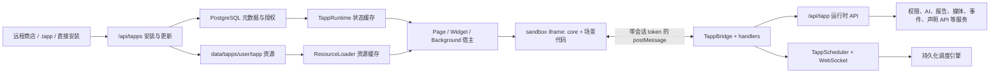
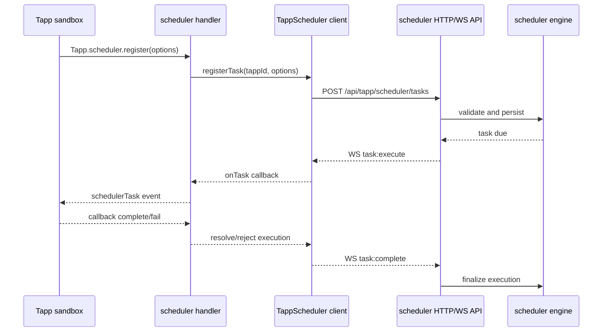

# Tapp 架构

本文描述当前代码中的 Tapp（Third-party App）实现。它是维护者理解安装、运行、
沙箱、后台任务和后端服务边界的总入口；字段与 API 的细节分别以
[Manifest](MANIFEST.md)、[SDK API](API_REFERENCE.md) 和
[REST API](REST_API.md) 为准。

Runtime Grant、One-shot Data Exchange、AI Task、Scoped Event Broker 和 Agent Interaction
的 V2 契约与迁移状态见
[Tapp Runtime V2 契约设计](CONTRACT_V2_DESIGN.md)。共享 registry/mailbox、Agent task 恢复、
宿主 intent adapter、签名 guest session 与硬存储配额均已进入当前实现。

## 一句话模型

Tapp 不是把第三方脚本直接加载到 Myriad 页面中，而是：

1. 后端校验并持久化 Manifest、代码、资源和授权结果；
2. 前端宿主根据场景只组合 `core + widget`、`core + page` 或纯 `core`；
3. 代码在带 CSP 的 sandbox iframe 中运行；
4. Tapp 只能通过 `postMessage` Bridge 调用宿主 SDK；
5. Bridge 做前端权限预检，后端再次做身份、所有权、权限、速率、输入和出站安全校验。

## 代码边界

| 层         | 主要位置                                                   | 职责                                               |
| ---------- | ---------------------------------------------------------- | -------------------------------------------------- |
| 页面入口   | `frontend/src/tapp/pages/`                                 | 列表、详情、单窗口/多窗口运行入口                  |
| 宿主状态   | `frontend/src/tapp/runtime/TappRuntime.ts`                 | 已安装/运行状态缓存、Widget 注册、后台需求         |
| 资源加载   | `frontend/src/tapp/runtime/sandbox/resourceLoader.ts`      | 获取、拆分、缓存代码/CSS/HTML/i18n/Page 模块       |
| 沙箱宿主   | `TappPageSandbox.tsx`、`TappWidgetSandbox.tsx`             | 创建 iframe、生成 HTML、注册对应 handler、清理实例 |
| 后台宿主   | `frontend/src/tapp/components/TappBackgroundRunner.tsx`    | 为需要常驻的运行中 Tapp 拉起 headless core         |
| SDK/Bridge | `runtime/sandbox/sdkGenerator.ts`、`runtime/TappBridge.ts` | 生成沙箱 SDK、验证消息、权限预检、分发 handler     |
| 前端 API   | `frontend/src/tapp/services/TappApiService.ts`             | Cookie/CSRF 请求、响应解包和前后端字段转换         |
| 安装与商店 | `backend/src/api/tapp_store.rs`                            | 安装、更新、导出、资源、Widget、存储、商店源       |
| 运行时 API | `backend/src/api/tapp_runtime/`                            | AI、数据、上下文、媒体、事件、报告、声明 API 等    |
| 调度入口   | `backend/src/api/tapp_scheduler.rs`                        | HTTP/WS 协议、身份/所有权/权限检查                 |
| 调度引擎   | `backend/src/services/tapp_scheduler.rs`                   | 任务持久化、触发、重试、前端回执、后端动作         |
| 声明 API   | `backend/src/services/tapp_api_service.rs`                 | 模板注入、出站请求、builtin、上下文隔离缓存        |

`frontend/src/tapp/types/index.ts` 是前端运行时类型入口。运行时类型不得依赖
`examples/`；示例目录只是内置开发/演示应用的源代码。

## Manifest、安装包与安装态

### 安装来源

系统有三条安装路径，但最终都生成同一种安装态：

| 来源     | 入口                                       | 行为                                                      |
| -------- | ------------------------------------------ | --------------------------------------------------------- |
| 直接安装 | `POST /api/tapps/install`, `source=direct` | 请求直接携带 Manifest、代码和可选资源                     |
| 商店安装 | `POST /api/tapps/install`, `source=store`  | 后端从已配置商店下载；网络失败时前端可下载后回退到 direct |
| 文件安装 | `POST /api/tapps/install-file`             | 上传 ZIP 格式 `.tapp`，安全解包后安装                     |

安装和更新时必须先校验 Tapp ID、Manifest 资源路径和命名资源键。安全的嵌套相对
路径会原样保留；绝对路径、隐藏路径、反斜杠和 `..` 会被拒绝。

### 两类持久化

- PostgreSQL 保存 Tapp 元数据、完整 Manifest、状态、最终授权、Widget、存储、
  调度任务/执行记录等结构化数据。
- `backend/data/tapps/{user_id}/{tapp_id}/` 保存代码、CSS、HTML、i18n 和 Page
  模块等安装资源。数据库中的历史路径字段只是兼容元数据，读取时会从已校验的
  owner + Tapp ID 重新计算可信路径。

Manifest 会经历 Rust 结构的反序列化和再序列化。因此新增 Manifest 字段时，必须
同步修改前端 `TappManifest`、后端 `TappManifest`（及嵌套结构）并增加 round-trip
测试，否则字段可能在安装、更新或导出后静默丢失。

### 所有权与可见性

- 管理员安装的 Tapp 是全局可见的管理员 Tapp。
- 普通用户可拥有自己的临时 Tapp；列表由管理员 Tapp 加当前用户 Tapp 组成。
- 游客只能读取允许公开读取的管理员 Tapp 信息，不能执行需要登录的变更。
- 同 ID 在不同 owner 上下文中可能并存；当前兼容规则统一为管理员公开版本优先，详情、
  资源、最终授权和 Manifest 声明 API 必须选择同一安装记录。V2 将由 Runtime Grant 显式
  携带 owner，消除仅凭 `tappId` 推断的歧义。

## `core`、`widget`、`page` 三层

`TappCodeStructure` 是宿主加载后的代码结构，不等同于磁盘上一定存在三个文件。
单体 `main.js` 可以通过标记拆分；模块化 Page 也可以由 `pageModules` 组合。

| 模式     | 执行代码                       | UI 资源                        | 主要宿主                   |
| -------- | ------------------------------ | ------------------------------ | -------------------------- |
| Widget   | `core + widget`                | 指定尺寸模板、Widget CSS       | `TappWidgetSandbox`        |
| Page     | `core + page` 或 `pageModules` | Page HTML、Page CSS、i18n      | `TappPageSandbox`          |
| Headless | 仅 `core`                      | 不加载 Page/Widget HTML 与 CSS | `TappPageSandbox headless` |

边界约束：

- `core` 放共享状态、后台监听、调度回调和不依赖可见 DOM 的逻辑。
- `widget` 只负责小组件定义/渲染；不要假设完整 Page SDK handler 都存在。
- `page` 负责完整页面生命周期和交互。
- headless core 没有可见容器，不能把后台任务写在 Page render/onReady 的 UI 分支中。

## 生命周期和状态

后端 `installed/running/...` 是持久化状态；`TappRuntime` 是前端缓存和事件协调器，
不是第二个权威数据库。

启动流程：

1. `TappRuntime.startTapp` 调用后端 start；
2. 本地状态改为 running；
3. 注册 Manifest 的 `backgroundRequirements`；
4. 页面、Widget 或后台 Runner 按需要创建独立 iframe；
5. iframe 销毁时清理 Bridge、事件、调度回调和 WebSocket 订阅。

停止会清除动态与 Manifest 后台需求并卸载 headless 实例。卸载还会清理资源缓存、
Widget/平台内存注册和安装资源；是否保留用户数据由 `keep_data` 选项决定。

## 后台 core

后台需求有两个来源：

- `manifest.backgroundRequirements`：用于刷新后恢复、无需先打开 UI；
- `Tapp.background.require/release`：运行期动态增减。

两类来源分别记录、读取时合并。`release` 只释放动态来源，不会误删 Manifest 声明。

`widget` 需求不算“真实后台需求”，因为可见 Widget 已有自己的沙箱；只有同时存在
`media`、`sync`、`notification`、`scheduler`、`event-listener` 或 `realtime` 等需求时，
`TappBackgroundRunner` 才额外启动 headless core。这避免每个 Widget Tapp 多跑一份
隐藏 iframe。

## 沙箱与 Bridge

### 浏览器边界

沙箱 HTML 使用随机 nonce CSP，默认 `connect-src 'none'`，并禁用 `fetch`、
`XMLHttpRequest`、`eval`、`Function`、本地存储和直接父窗口访问。图片允许 HTTP(S)
是为了展示头像/封面，不代表脚本可以直接发网络请求。

每个 iframe 有独立随机会话 token。宿主同时验证：

- 消息结构、ID、时间戳和 payload；
- `event.source === iframe.contentWindow`；
- 会话 token；
- action 是否在静态权限映射中；
- 当前安装实例的 `grantedPermissions` 是否包含所需权限。

未知 action 默认拒绝。前端检查只用于快速失败和缩小攻击面，不能代替后端校验。

### Runtime Grant

Page、Widget 和 headless 每个实例启动时由宿主申请 5 分钟 Runtime Grant。令牌只保存在
父页面内存，Bridge 调用运行时后端时附加 `X-Tapp-Runtime-Grant`，不会写入 iframe HTML
或 `postMessage`。服务端只保存令牌 SHA-256，校验当前 Claims subject、Tapp、owner、
runtime ID 和最终权限；停止、更新、卸载或 Bridge 销毁会撤销对应 Grant。Grant 的哈希与
租约保存在 PostgreSQL `tapp_runtime_registry`，签发上限与同实例替换在事务锁内完成，因此
后端重启或请求切换副本不会使有效 Grant 丢失。

公开商店/Tapp 列表读取和 scheduler 的宿主共享 WebSocket 不属于
单个沙箱请求，不要求 Runtime Grant。Brew、语音和联邦等由宿主代理的旧服务仍依赖
Bridge 权限与 `connect-src 'none'` 隔离，后续会继续补服务端 Tapp 归因。

### Page 与 Widget 的 handler 不对称

Page 注册完整 handler 集合。Widget 为减少能力面和启动成本，只注册生命周期、UI、
存储、文件、AI chat、平台/报告读取、上下文/声明 API、媒体、语音、动画、后台需求和
调度等必要集合；平台与报告写 handler 不会进入 Widget。新增 SDK 方法时必须同时核对：
SDK 生成器、权限映射、目标沙箱的 handler、后端路由/服务和文档。

## 权限模型

安装请求中的权限只是“申请集合”。后端会用当前实时角色与动态下放配置过滤，最终
`granted_permissions` 才是运行时事实。

| 等级       | 默认含义                                                                |
| ---------- | ----------------------------------------------------------------------- |
| basic      | 基础能力；仍需在 Manifest 申请并被授予                                  |
| elevated   | 管理员可配置向普通用户/游客下放                                         |
| privileged | 仅管理员，例如 `platform:write`、`platform:register`、`component:agent` |

权限等级、SDK action 映射和后端枚举目前分别存在于 TypeScript 与 Rust 中；修改时必须
同步并运行权限/类型检查。后端永远是授权判定的最终边界。

`Tapp.user.getAllowedPermissionLevels()` 查询后端当前动态下放配置，回答角色在系统层面
能否使用某个等级；`Tapp.permissions` 才是当前安装实例实际获得的权限集合。两者不能
互相替代。

## 调度器

调度链路不是浏览器里的 `setInterval` 替代品，而是持久化任务系统：

- `frontend/src/tapp/runtime/TappScheduler.ts` 是共享的 HTTP/WS 客户端。
- handler 首次使用 scheduler 时才初始化连接；不用调度的 Tapp 不会空开 WebSocket。
- `executionTarget=frontend` 依赖运行中的 Page/Widget/headless core 注册回调。
- `executionTarget=backend|both` 必须声明并通过后端校验 `backendActions`。
- global scope 仅管理员可注册；所有注册仍检查 Tapp 所有权和
  `scheduler:register`。

需要刷新后继续接收 frontend 任务的应用，应把 `scheduler` 写入
`backgroundRequirements`，并在 core 中注册 `onTask`。

## 声明式 API 与网络访问

沙箱不提供任意网络代理端点。Tapp 在 Manifest 的 `apis` 中按名称声明 HTTP 或 builtin
能力，再调用 `Tapp.api(name, params)`：

1. Bridge 转到 `POST /api/tapp/{tappId}/api/{apiName}`；
2. 后端按当前用户/owner 解析 Manifest；
3. 检查 access、权限、频率和模板参数；
4. HTTP 类型走统一出站安全客户端，builtin 走受控内部能力；
5. 缓存键包含 Tapp、用户、客户端上下文、API 名和参数，避免跨用户复用。

不要恢复旧式“传任意 URL 的 `/proxy`”设计；它会绕过 Manifest 审计和 SSRF 边界。

## 性能策略

- 商店弹窗及内置示例按需加载，不进入 Tapp 列表首屏包。
- ResourceLoader 对 raw/Widget/Page/CSS 分层缓存，并对同 key 请求去重；安装、更新、
  卸载后必须清理对应 Tapp 缓存。
- TappRuntime 列表缓存 TTL 为 30 秒；启动同步使用批量详情接口，Widget 也按集合读取。
- 前端权限等级以 `permissionConfig.ts` 为单一注册表；Manifest 校验复用该表，不再维护第二份
  描述/等级副本。
- `QuotaManager` 只保存平台读写与声明 API 的短期滑动窗口，未跟踪 action 不创建记录，
  失败调用不计数。AI calls、tokens 与 cooldown 由 PostgreSQL 服务端账本统一执行，前端只展示
  usage snapshot，不再维护另一套计费事实。
- 只有真实后台需求才创建 headless iframe；只有首次 scheduler 调用才连接 WS。
- 仅订阅浏览器本地 `system.*` topic 的 runtime 不建立后端 Event SSE；混合或 Tapp topic
  订阅才连接共享 mailbox。
- Widget 和 Page 使用不同资源与 handler 集，避免无关代码在每个实例重复执行。
- Widget 默认由 storage 变更或显式 `invalidate` 事件驱动刷新；可选 interval 仅在页面与
  Widget 可见时计时。Page、Widget、headless core 间的同 Tapp storage 变更由宿主广播。
- Manifest 顶层 `settings` 是 Tapp 全局设置；`widgets[].settings` 保存到 Dashboard
  布局中的实例 `config`，同类 Widget 的多个实例互不覆盖。

`syncFromBackend` 通过 `GET /api/tapps/details` 一次读取当前会话可见的完整详情。后端固定
查询管理员 Tapp 与当前用户 Tapp，并复用单项接口的角色权限过滤；同 ID 时管理员版本优先。
前端不再执行列表后逐项详情读取的 N+1 请求。

另一个现有契约限制是 Widget 模板内容在安装请求和资源响应中以“尺寸”为 key，而不是
`widgetId + 尺寸`。因此同一 Tapp 的多个 Widget 不能把相同尺寸映射到不同模板；安装器
会拒绝这种会在运行时覆盖的 Manifest。若要支持它，需要同步升级商店索引、安装请求、
资源响应和 Widget 宿主选择逻辑，属于需要单独设计的版本化契约变更。

Agent Interaction V2 由可信 Agent 后端创建具名 interaction，Tapp 通过在线 SSE 接收并由单一
runtime 接受；输入与结果都按 Manifest schema 校验，生命周期、幂等和 intent 的宿主确认由
后端状态机约束。旧 `onFill()` 只映射显式声明的 `legacy.fill`；无消费者的 `reportData()` 与
`requestAction()` 已改为明确返回 `UNSUPPORTED_LEGACY_AGENT_ACTION`。当前结果会安全存储并可
由 Tapp 查询。Executor 遇到 interaction 会持久化为 `waiting_for_input`；结果或拒绝由任意
副本从 `agent_tasks` 恢复原任务。`ui.open`、`report.create` 与 `dataExchange.request` 有可信
宿主 adapter，其中跨 Tapp 数据仍只显示 Data Exchange 的一张明细化一次性授权弹窗。

Scoped Event Broker 使用 Manifest publish/subscribe allowlist 与 Runtime Grant 路由在线实例。
`instance` 只协调当前 Tapp runtime，`owner` 可通知同一 subject 下明确订阅的其他在线 Tapp；
交付语义固定为 at-most-once，无 ACK、重试或离线积压。跨 Tapp 的 owner payload 只允许 8 KiB
浅层元数据并拒绝常见正文键，数据正文必须走 One-shot Data Exchange。旧订阅持久化端点返回
410；旧 publish 仅保留 `target=self` 到 instance scope 的窄适配。guest subject 来自浏览器
持有的 HttpOnly HMAC 签名 session，不再由 IP 推导；游客仍按策略禁止 owner publish。
带 dedupeKey 的投递通过 PostgreSQL advisory lock 将 mailbox 写入与去重记录放在同一事务，
跨副本并发重试不会产生重复事件。
宿主已提供 `system.theme.changed`、`system.network.changed`、`system.locale.changed`、
`system.visibility.changed` 与 `system.navigation.changed` producer。

AI V2 将 generate/analyze/chat/image 统一为服务端任务，校验 Manifest operation、model tier、
context source 与 output format，限制并发和执行/保留时间，并通过 SSE 返回 delta/progress/state。
calls、tokens 与 cooldown 以 `(subject, owner, tapp, UTC day)` 持久化，调用前预留、完成时结算、
失败或取消释放未消耗 token。V1 仍保留已真实支持字段；过去被忽略的 options 现在返回
`UNSUPPORTED_V1_OPTION`，不再接受后静默忽略。

当前 Tapp storage 按 `user_id + tapp_id` 隔离，单值上限 1 MiB，总量上限 5 MiB；写入在同一
事务内加 subject/Tapp advisory lock、计算替换后的 JSONB 字节并 upsert，并发副本不能越过
总量边界。Tapp 不能直接指定另一个 Tapp 的 key。已实现的
One-shot Data Exchange 使用 Manifest 具名 export/import、同 subject 隔离、宿主“仅本次”
授权弹窗和绑定 provider 安装 owner 的服务端原子消费一次性 Data Access Grant。提供方 handler
只能返回声明 schema
内、大小/记录数上限内的结果；失败也会耗尽 token。首版只选择已在线并注册 export 的
Page、Widget 或 headless runtime，不隐式拉起没有后台需求的完整 Page。Event 仍只负责
通知，不能承载 export 正文绕过这次授权。

上述能力的边界与迁移方案统一记录在版本化的
[V2 契约设计](CONTRACT_V2_DESIGN.md)。Runtime Grant、Data Exchange、AI Task、Event Broker
与 Agent Interaction 协议均已有首版；Runtime Grant、Data Exchange、Event、AI task 和 Agent
interaction 使用 PostgreSQL TTL registry 与持久 mailbox。写入同时发出可供 listener 使用的
`pg_notify` 唤醒信号；当前 SSE 以 mailbox 轮询作为消费与补读路径，通知丢失或副本切换不会
丢掉权威状态。

仓库不是可发布的前端 SDK 包。未被任何 Astro 入口引用的 `frontend/src/tapp/index.ts` 和
`frontend/src/tapp/services/index.ts` 旧聚合导出已删除；运行时代码按实际边界直接引用，
避免聚合入口掩盖依赖和保留死导出。

## 变更检查清单

修改 Tapp 架构时至少核对：

1. Manifest 前端类型、Rust 类型、安装/更新/导出 round-trip 是否一致；
2. Page、Widget、headless 实际加载了哪些代码和资源；
3. SDK action 是否有权限映射和目标沙箱 handler；
4. 后端是否再次检查当前身份、owner、权限、速率和输入；AI 预留/结算是否落到服务端账本；
5. 安装/更新/卸载是否清除运行时与资源缓存；
6. frontend `pnpm build:check`；
7. backend Tapp 定向测试与 `cargo clippy --all-targets -- -D warnings`；
8. `git diff --check`，以及文档端点/字段与当前路由和序列化结构一致。
