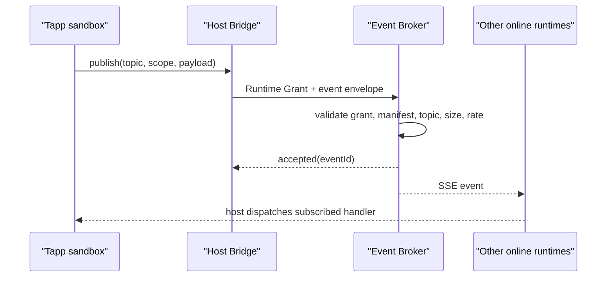

# Tapp Runtime 契约设计

状态：**当前主路径已实现，多副本与编排闭环已完成**。Runtime Grant、One-shot Data
Exchange、Server-governed AI Task、Scoped Event Broker 和 Agent Interaction 均已有代码与
SDK；共享 registry/mailbox、Agent 任务暂停/恢复和 intent 执行 adapter 已接入。当前行为以
[架构文档](ARCHITECTURE.md) 和 [SDK API](API_REFERENCE.md) 为准。

## 设计目标

当前契约不再继续给现有占位字段补零散 handler，而是统一解决五个问题：

1. 后端能识别“哪个用户的哪个 Tapp 实例”正在调用，而不只知道登录用户；
2. Agent 交互有明确的请求、结果、意图和生命周期；
3. Event 真正支持跨窗口与 headless 实例，同时给出明确的投递语义；
4. AI 的上下文、流式响应、成本上限和配额全部由服务端执行。
5. 跨 Tapp 数据读取必须经过可见、一次性的用户授权，不能借 Event 或共享存储绕过。

不在本次设计中改变 Widget 模板按尺寸寻址的现有约束。

## 共同基础：Runtime Grant

Cookie 只能证明用户身份，不能证明调用来自哪个 Tapp。当前已引入宿主签发的短期、
服务端有状态 Runtime Grant：

```json
{
  "version": 2,
  "runtimeId": "rt_...",
  "tappId": "com.example.app",
  "ownerId": 42,
  "subjectId": 108,
  "instanceId": "page_...",
  "kind": "page",
  "permissions": ["event:subscribe", "ai:chat"],
  "expiresAt": "2026-07-15T12:05:00Z"
}
```

- Page、Widget、headless 启动时由宿主申请，令牌仅保存在宿主内存，不暴露给 iframe。
- Bridge 调后端时由宿主附加 `X-Tapp-Runtime-Grant`；Cookie/CSRF 规则保持不变。
- 有效期 5 分钟，宿主在过期前刷新。后端只保存 token SHA-256；停止、更新、卸载、
  Bridge 销毁和显式 revoke 会删除匹配记录，使旧令牌立即失效。
- 后端从 Grant 得到 `tappId + owner + subject + permissions`，所有运行时路由统一验证；
  请求体里的 `tappId` 只作一致性校验，不再是可信身份来源。
- Runtime Grant 只约束 Tapp 运行时 API；公开 Tapp 列表和商店读取不需要它。

这一步是跨 Tapp Data Exchange、Agent、Event、AI Task 的共同前置条件。当前 `/api/tapp`
运行时路由和 Tapp storage 已迁移；Brew、语音和联邦等宿主代理旧服务仍需继续补服务端
Tapp 归因。Grant 哈希与租约位于 PostgreSQL 共享 TTL registry，支持跨副本校验与撤销。

## 跨 Tapp 数据：One-shot Data Exchange

### 隔离原则

每个 Tapp 的 storage、报告和内部状态默认私有。Tapp 不能直接指定另一个 `tappId` 去读取其
表、文件或 storage key；跨 Tapp Event 也只承载通知，不得成为规避授权的数据通道。

数据提供方必须在 Manifest 声明具名 export 及响应 schema，调用方必须声明 import。运行时
再由调用方发起带用途的请求：

```json
{
  "dataExchange": {
    "exports": [
      {
        "id": "playlist.current",
        "schema": {
          "type": "array",
          "items": {
            "type": "object",
            "required": ["title"],
            "properties": {
              "title": { "type": "string" },
              "artist": { "type": "string" }
            },
            "additionalProperties": false
          }
        },
        "maxBytes": 262144,
        "maxRecords": 200
      }
    ],
    "imports": [
      {
        "tappId": "com.example.player",
        "exportId": "playlist.current"
      }
    ]
  }
}
```

```typescript
const playlist = await Tapp.dataExchange.request({
  targetTappId: "com.example.player",
  exportId: "playlist.current",
  params: { fields: ["title", "artist"] },
  purpose: "把当前播放列表加入周报",
});
```

声明只表示接口兼容，不等于用户已授权。每次逻辑数据交换都必须由宿主展示原生授权弹窗，
清楚列出：调用方 Tapp、数据提供方 Tapp、export/字段范围、用途、最大记录数或字节数，以及
“仅本次”有效范围。当前版本不提供“始终允许”；关闭弹窗、拒绝或超时都返回明确错误。

### 一次性 Data Access Grant

用户同意后，后端签发独立于 Runtime Grant 的一次性 Data Access Grant：

```json
{
  "version": 1,
  "grantId": "dxg_...",
  "token": "host-only opaque token",
  "requestId": "dxr_...",
  "providerTappId": "com.example.player",
  "providerOwnerId": 42,
  "exportId": "playlist.current",
  "params": { "fields": ["title", "artist"] },
  "purpose": "把当前播放列表加入周报",
  "requestHash": "sha256:...",
  "maxBytes": 262144,
  "maxRecords": 200,
  "expiresAt": "2026-07-15T12:01:00Z"
}
```

- Grant 只存在于宿主与后端之间，不暴露给任一 iframe；60 秒过期。
- 后端在 Provider 返回后以原子操作消费 Grant。一次逻辑请求只能返回一个受限结果，不能
  换参数、换 export、换目标或重放；成功和失败响应都会耗尽 token。宿主超时后丢弃 pending
  调用，未消费 token 最迟在 60 秒 TTL 到期时失效。
- 只允许相同 `subjectId` 的 Tapp 交换数据。跨用户、跨租户数据访问不能靠弹窗放行。
- Provider 的 Tapp ID 和安装 owner 都必须与其 Runtime Grant 一致，防止管理员共享版与用户
  自有同 ID 安装发生错配。
- Provider 通过声明的 handler 读取自己的私有数据并返回结果；Broker 不直接暴露其 storage。
  首版 Provider 必须已有 Page、Widget 或 headless runtime 在线并注册 handler；声明真实
  `backgroundRequirements` 可使 core 常驻。尚不为离线 Provider 隐式启动完整 Page。
- Broker 在返回调用方前验证响应 schema 与字节/记录上限，并写入不含正文的结构化服务端
  日志。Provider 不可用、schema 不匹配或超限时，不返回部分数据。

### 授权流程

```mermaid
sequenceDiagram
  participant R as "Requester Tapp"
  participant H as "Host"
  participant U as "User"
  participant X as "Data Exchange Broker"
  participant P as "Provider Tapp"
  R->>H: request(target, export, params, purpose)
  H->>X: Runtime Grant + request
  X->>X: validate both manifests and same subject
  H->>U: one-shot consent dialog
  U-->>H: allow once
  H->>X: authorize one-shot Data Access Grant
  X-->>H: host-only token
  H->>P: invoke declared provider handler without token
  P-->>H: schema-bound result
  H->>X: atomically consume token with result
  X->>X: validate schema and bounds; log metadata
  X-->>H: bounded result; grant is exhausted
  H-->>R: result or explicit error
```

AI context 引用另一个 Tapp 的数据时必须复用同一流程，不能由服务端静默扩权。Agent intent
只能发起 exchange request，不能代替用户点击授权。Event Broker 对跨 Tapp payload 设置更小
上限并禁止承载 export 正文，避免把数据读取伪装成事件广播。

## 方案一：Agent Interaction Protocol

### 新模型

Agent 不再直接“调用一个 Tapp 回调”，而是创建一个有状态的 `Interaction`。Tapp 只能对
当前 Interaction 回传结构化结果或提出声明式意图，宿主负责执行策略与用户确认。

```typescript
interface AgentInteraction<TInput = unknown> {
  version: 2;
  interactionId: string;
  type: string;
  input: TInput;
  inputSchema?: string;
  deadline: string;
  source: { agentId: string; taskId?: string };
}

type InteractionState =
  "pending" | "accepted" | "completed" | "rejected" | "expired" | "cancelled";
```

Manifest 声明可处理的交互类型与结果 schema，而不是任意 action 字符串：

```json
{
  "agent": {
    "protocolVersion": 2,
    "interactions": [
      {
        "type": "report.compose",
        "inputSchema": "schemas/report-input.json",
        "resultSchema": "schemas/report-result.json"
      }
    ],
    "intents": ["ui.open", "report.create"]
  }
}
```

建议 SDK：

```typescript
Tapp.agent.onInteraction("report.compose", async (interaction) => {
  await interaction.accept();
  const result = await buildReport(interaction.input);
  await interaction.submitResult({ data: result, summary: "报告已生成" });
});

await interaction.requestIntent({
  type: "ui.open",
  params: { tappId: "com.example.report-preview" },
  reason: "让用户确认生成结果",
});
```

### 边界与处理规则

- `submitResult` 取代语义不明的 `reportData()`；结果必须通过 Manifest 声明的 schema。
- `requestIntent` 取代 `requestAction()`；宿主按 allowlist、Manifest、当前任务状态与确认策略
  授权后，立即调用受信宿主 adapter 执行 `ui.open`、`report.create` 或
  `dataExchange.request`，不会把任意动作执行权交还给 Tapp。
- 每个消息都携带 `interactionId`，重复提交以幂等键去重；超时或取消后拒绝迟到结果。
- Interaction 记录只保存结构化元数据和最终结果引用，敏感大对象进入受权限保护的存储。
- Agent 只能选择 Tapp 已声明且已安装的 interaction type；Tapp 不能伪造 Agent task。

### 迁移

`onFill()` 在一个版本周期内由适配器映射为 `type = "legacy.fill"`。现有无消费者的
`reportData()`、`requestAction()` 标记 deprecated，并在当前模式下明确返回
`UNSUPPORTED_LEGACY_AGENT_ACTION`，不再静默成功。

## 方案二：Scoped Event Broker

### 新模型

Event Broker 是后端路由的实时消息，不再是“保存订阅数组后只回送给当前 iframe”。第一版
明确选择 **在线 at-most-once**：在线实例尽力投递一次，离线不积压。需要离线可靠投递的
业务继续使用 scheduler 或专门的数据模型，避免把事件总线变成隐式任务队列。

```typescript
interface TappEvent<T = unknown> {
  version: 2;
  eventId: string;
  topic: string;
  scope: "instance" | "owner";
  source: { tappId: string; runtimeId: string };
  payload: T;
  occurredAt: string;
  dedupeKey?: string;
}
```

寻址规则：

- `instance`：只投递给同一 Tapp 的当前 runtime；用于 Page/Widget 内协调。
- `owner`：投递给同一 subject（当前用户/稳定 guest）下、Manifest 明确订阅该 topic 的在线
  实例；允许跨 Tapp。这里不能按管理员共享 Tapp 的安装 owner 广播，否则会跨真实用户泄漏。
  guest subject 由浏览器级 HttpOnly 签名 session 派生；游客仍按权限策略禁止 owner publish。
- `system.*` 只能由宿主发布；Tapp 自定义 topic 必须是 `tapp.<publisherId>.*`。宿主当前产生
  theme、network、locale、visibility 与 navigation 变更事件。
- 删除自由格式 `target tappId`；接收方由 topic、scope、Manifest 声明和 Runtime Grant 共同
  决定，避免调用方直接绕过订阅策略点名其他 Tapp。

Manifest 示例：

```json
{
  "events": {
    "publish": ["tapp.com.example.player.track.changed"],
    "subscribe": [
      "system.theme.changed",
      "tapp.com.example.player.track.changed"
    ]
  }
}
```

### 路由与生命周期



- 后端维护在线 `runtimeId` 注册表；Page、Widget、headless 使用宿主持有的 SSE 连接，Grant
  到期后刷新并重连。
- 前端 `on()` 只管理当前 runtime 的回调，不再把回调存在后端；Manifest 是可订阅范围，
  在线注册表是实际接收者。
- payload 建议上限 64 KiB，topic 上限 128 字符；按 Runtime Grant 限速。
- `owner` 事件只用于状态通知和失效提示；跨 Tapp 数据正文必须走 One-shot Data Exchange。
- 发布成功只表示 Broker 接受，不表示每个订阅者已处理。当前契约不提供 ACK、重试或离线积压。
- `dedupeKey` 只在短窗口内防止发布方重试造成重复，不提升投递保证。

### 迁移

旧 `subscribe/unsubscribe` 存储数据不自动迁移为声明式订阅；安装更新时从新 Manifest 生成
声明。旧 `publish(type, payload, target)` 仅允许 `target = "self"` 并映射为 `instance`，
其他 target 返回明确错误，直到旧接口移除。

## 方案三：Server-governed AI Task API

### 新模型

文本生成、分析、对话和图片生成统一成为服务端任务。Tapp 选择“操作与输入”，服务端选择
供应商、模型、实际参数上限和预算；任何未实现字段都返回校验错误，不再接受后忽略。

```typescript
interface AITaskRequest {
  version: 2;
  operation: "generate" | "analyze" | "chat" | "image";
  input: unknown;
  context?: AIContextRef[];
  output?: { format: "text" | "json" | "image"; schema?: string };
  delivery?: "result" | "stream";
  idempotencyKey?: string;
}

type AIContextRef =
  | { type: "platform"; platform: string; selector: string }
  | { type: "report"; reportId: string }
  | { type: "profile"; fields: string[] }
  | { type: "custom"; value: unknown };
```

Manifest 只声明能力与预算层级，不暴露供应商参数：

```json
{
  "ai": {
    "protocolVersion": 2,
    "operations": ["generate", "chat"],
    "modelTier": "standard",
    "contextSources": ["platform", "report", "custom"],
    "outputFormats": ["text", "json"]
  }
}
```

建议后端契约：

- `POST /api/tapp/ai/v2/tasks`：校验并创建任务，返回 `taskId`、预算快照和初始状态；
- `GET /api/tapp/ai/v2/tasks/{taskId}`：读取状态与最终结果；
- `GET /api/tapp/ai/v2/tasks/{taskId}/events`：SSE 流式 token/progress；
- `DELETE /api/tapp/ai/v2/tasks/{taskId}`：取消尚可中断的任务；
- `GET /api/tapp/ai/v2/usage`：返回服务端权威 calls/tokens/cooldown。

### 配额与安全

- 配额账本以 `(subjectId, ownerId, tappId, UTC day)` 为键持久化；预留预算后才调用模型，
  完成时按真实 usage 结算，失败或取消释放未消耗预留。
- 每分钟速率、每日 calls、每日 tokens、并发数和 cooldown 全部服务端执行；图片任务计入
  calls，但首版尚未维护独立货币成本账本。
  前端只显示服务端状态和快速提示，不再维护另一套计费事实。
- `temperature/maxTokens` 不由 Tapp 任意指定。若产品需要可调，只提供服务器定义的
  `quality = fast | balanced | high`，并映射到受限参数。
- 上下文按引用解析并记录 provenance，每类来源有独立字节预算；Tapp 不能把“读取所有
  用户数据”伪装成一段自由 prompt。
- JSON 输出必须经过 schema 校验；失败可按服务端策略有限重试并计入实际用量。
- SSE 状态端点可用于两种 delivery；只有 `delivery = stream` 产生 token delta，普通 result
  请求只产生进度、状态和最终结果事件。

### 迁移

旧接口适配器只映射已实际支持的字段：prompt/messages、chat context、`preferPro`。当前被忽略
的 `generate.context/options` 与 `chat.maxTokens/temperature/stream` 在迁移期返回带字段名的
`UNSUPPORTED_V1_OPTION`，促使调用方显式迁移。旧接口响应中的硬编码 `quotaRemaining` 改为
真实 usage 快照；一个版本周期后移除旧端点。

## 推荐实施顺序

1. Runtime Grant：先覆盖所有 `/api/tapp` 路由，并增加停止/卸载撤销测试；
2. One-shot Data Exchange：先交付 Manifest 契约、授权弹窗、一次性 Grant 和同用户隔离；
3. AI Task：成本与权限风险最高，把真实配额、任务状态和流式契约收口；
4. Event Broker：复用 Runtime 注册表/连接层，实现在线 at-most-once Broker；
5. Agent Interaction：在 Runtime Grant 与事件/任务基础上实现 Interaction 状态机；
6. 保留一个版本周期的窄适配器，记录旧接口使用量，再删除无消费者入口与兼容字段。

当前进度：1 已完成核心路由迁移和共享 Grant；2 已完成 Manifest round-trip、宿主授权弹窗、在线
Provider broker、一次性 Grant、同 subject 隔离及响应边界；3 已完成持久化用量账本、任务
状态机、上下文/输出校验和 SSE；4 已完成在线 at-most-once 路由、Manifest allowlist 与窄
legacy adapter；5 已完成 interaction schema、CAS 接受/提交/拒绝状态机、Executor 恢复以及
`ui.open`、`report.create`、`dataExchange.request` 宿主 adapter。在线状态使用 PostgreSQL
TTL registry、durable mailbox 与 `pg_notify` 提示。尚未完成的是第 6 步兼容接口观测期后的
最终删除；它需要依据实际旧接口使用量单独安排。

每一阶段都应同时交付 Rust/TypeScript 类型、Manifest round-trip、权限矩阵、端到端测试和
迁移说明。任何阶段都不应通过继续扩大前端 Bridge 信任面来替代后端验证。
